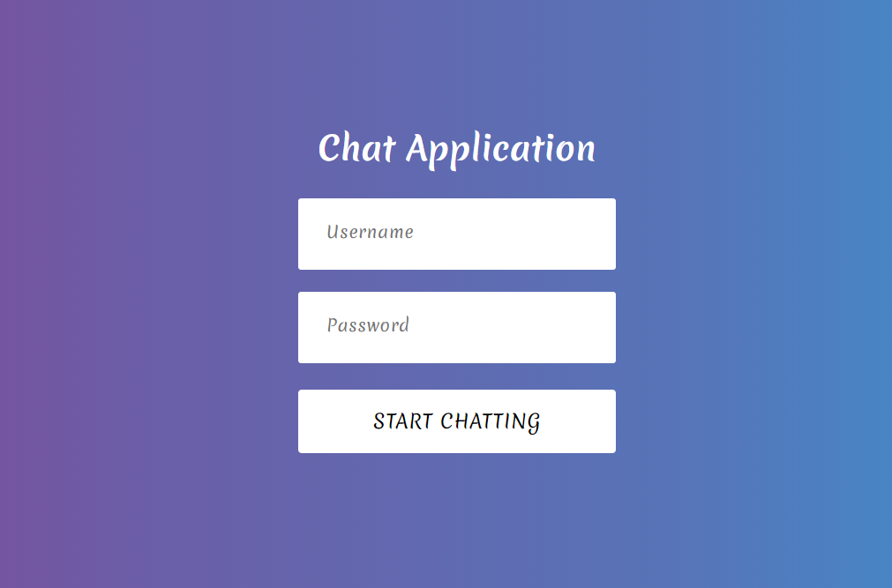

# Project: A Chat App

This is a simple chat app built with React. Users can sign in with Google, create chat groups and chat with different members in the groups.

 

## Built With

- ReactJS
- Chat Engine API
- CSS

## Live link
<a href="https://ejokachat.netlify.app">Live Link</a>

## Getting Started

Open your terminal or text editor and use next command

        git clone https://github.com/emmanuelkamala/chat-application.git

        cd chat-application

        Run 'npm install' command to install package dependencies.

## Run the app

npm start

visit: http://localhost:3000

## Author

👤 **Author1**

- Github: [emmanuelkamala](https://github.com/emmanuelkamala)
- Twitter: [ejkamala](https://twitter.com/ejkamala)
- Linkedin: [emmanuelkamala](https://linkedin.com/in/emmanuelkamala)

## 🤝 Contributing

Contributions, issues and feature requests are welcome!

Feel free to check the [issues page](issues/).

## Show your support

Give a ⭐️ if you like this project!
